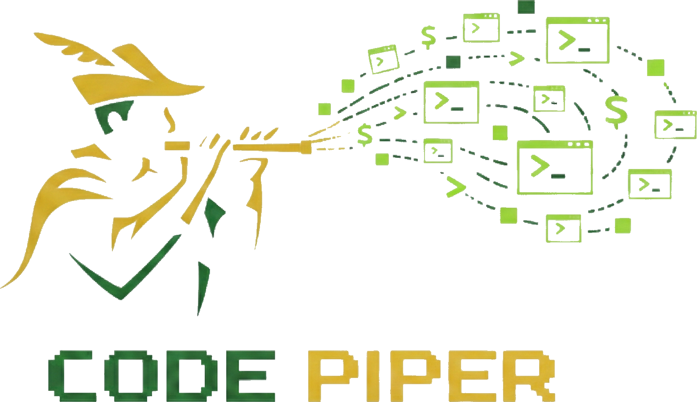

<p align="center">
  
</p>

<p align="center">
  <strong>Run and manage multiple AI coding sessions from a single control plane</strong><br/>
  CLI + Web dashboard &middot; Permission policies &middot; Workflow orchestration &middot; Analytics
</p>

---

# CodePiper

CodePiper is a daemon that spawns, monitors, and controls multiple concurrent provider sessions (currently [Claude Code](https://code.claude.com) and Codex CLI). Each session runs inside its own tmux pane with a real TTY, so every interaction works as close as possible to a normal terminal.

You get a CLI (`codepiper`) for scripting and automation, and an optional web dashboard for visual monitoring with live terminal views, conversation rendering, token analytics, and policy management.

## System At A Glance

```text
User
 |- codepiper CLI -----------.
 |                           |
 '- Web Dashboard -----------+--> Daemon API --> Session Manager
                                                |- tmux runtime
                                                |- SQLite
                                                '- Provider Registry
                                                    |- Claude Code
                                                    '- Codex CLI
```

**Key capabilities:**

- **Multi-session control** — Start, stop, attach, send text, and send key sequences to any session
- **Permission policies** — Auto-approve or deny tool use via glob-pattern rules with full audit log
- **Web dashboard** — Real-time terminal, conversation view, token charts, workflow runner
- **Workflow orchestration** — Chain multi-session tasks via YAML/JSON definitions
- **Analytics** — Token usage, model distribution, cache efficiency, estimated cost
- **Transcript tailing** — JSONL ingestion with crash-safe byte-offset resumption
- **Secure by default** — Unix socket, password + TOTP auth, encrypted env storage

## Why Teams Use CodePiper

- **Multi-device continuity** — Keep sessions running on one machine and continue monitoring/responding from another device via web dashboard.
- **Parallel execution** — Run implementation, review, and verification sessions concurrently.
- **Safer autonomy** — Apply explicit policy guardrails (`allow|deny|ask`) with auditable decision logs.
- **Provider unification** — Operate Claude Code and Codex sessions from one control plane.
- **Recoverability** — Resume/recover sessions after interruptions instead of losing context.

### Common Use Cases

- **Parallel feature delivery** — one session writes code, another reviews diffs, another runs tests.
- **Multi-repo operations** — manage related services/repositories from one dashboard.
- **Long-running task monitoring** — receive completion signals without babysitting each terminal.
- **Secure AI workflows** — enforce policy boundaries while keeping a full decision audit trail.
- **Cross-device continuity** — start on desktop, check status/respond from laptop or mobile.

## Provider Availability (Codex vs Claude Code)

| Capability | Claude Code | Codex |
|------------|-------------|-------|
| Native hook events | Yes | No |
| Policy channel | `native-hooks` | `input-preflight` |
| Dangerous mode | Yes | Yes |
| Provider resume/fork | Yes | Yes |
| Tmux recover/adopt | Yes | Yes |
| Transcript tailing | Yes | No |
| Model switch API | Yes | No |
| Token analytics fidelity | High (transcript) | Partial (PTY) |
| Session detail logs/events tabs | Yes | No (hidden) |

Detailed matrix: `docs/features/provider-capability-matrix.md`.
Contributor onboarding guide: `docs/features/provider-extensibility.md`.

```text
/providers capability metadata
        |
        v
Web session-detail tab resolver
  - nativeHooks OR supportsTranscriptTailing
      -> terminal/git/policies/logs/events
  - otherwise
      -> terminal/git/policies
```

## Prerequisites

CodePiper needs Bun + tmux, and at least one provider CLI.

### Required (core runtime)

| Dependency | Minimum version | Install |
|------------|-----------------|---------|
| **Bun** | 1.3.5+ | [bun.sh](https://bun.sh) — `curl -fsSL https://bun.sh/install \| bash` |
| **tmux** | 3.0+ | [tmux wiki](https://github.com/tmux/tmux/wiki/Installing) — macOS: `brew install tmux` |

### Required (choose provider CLI)

| Dependency | Minimum version | Install |
|------------|-----------------|---------|
| **Claude Code** | latest | [Claude Code install](https://code.claude.com/docs/en/installation) — `npm install -g @anthropic-ai/claude-code` |
| **Codex CLI** | latest | [OpenAI Codex docs](https://developers.openai.com/codex) |

### Optional (feature-specific)

| Dependency | Needed for |
|------------|------------|
| **git** | Git panel/routes (`/git/*`), worktree automation |
| **HTTPS origin + Web Push VAPID keys** | Remote/mobile push notifications |
| **Custom STT command binary** | `/sessions/:id/terminal/transcribe` voice transcription |

**Platform:** Linux or macOS (Windows requires WSL).

Supported target matrix:

| OS | Architectures |
|----|---------------|
| Linux | `x64`, `arm64` |
| macOS | `arm64`, `x64` |

Verify prerequisites are available:

```bash
bun --version     # should print 1.3.5 or higher
tmux -V           # should print tmux 3.x
claude -v         # should print the Claude Code version
codex --version   # optional: required only for codex provider sessions
git --version     # optional: required for Git features
```

Linux `tmux` quick installs:

```bash
# Debian/Ubuntu
sudo apt-get update && sudo apt-get install -y tmux

# Fedora/RHEL
sudo dnf install -y tmux

# Alpine
sudo apk add tmux
```

## Quick Start

### Install from npm (global)

Use this path when installing CodePiper as a published package.

```bash
# 0. Prerequisites (required before installing CodePiper)
bun --version     # 1.3.5+
tmux -V           # 3.x

# 1. Install CodePiper globally from npm
npm i -g codepiper

# 2. Verify install and environment
codepiper doctor

# 3. Start daemon (CLI-only)
codepiper daemon

# 4. Or start daemon with web dashboard
codepiper daemon --web
```

`codepiper` is distributed as source TypeScript entrypoints and requires a local Bun runtime. Bun is not bundled inside the npm tarball.

If Bun is missing, you will typically see:

```bash
/usr/bin/env: bun: No such file or directory
```

Install Bun from [bun.sh](https://bun.sh) and rerun.

For deployment, troubleshooting, and FAQ, see:

- `docs/operations/production-deployment.md`
- `docs/operations/troubleshooting.md`
- `docs/operations/faq.md`
- `docs/operations/release-checklist.md` (maintainers)

### Install from source (development checkout)

```bash
# 1. Clone and install
git clone <repo-url> && cd codepiper
bun install

# 2. Link the CLI globally (makes `codepiper` available everywhere)
bun link

# 3. Verify prerequisites
codepiper doctor

# 4. Start the daemon (CLI-only)
codepiper daemon

# 5. In another terminal — start a session
codepiper start -p claude-code -d /path/to/repo
codepiper start -p codex -d /path/to/repo
codepiper sessions                    # list active sessions
codepiper attach <session-id>         # attach to terminal
tmux attach-session -t codepiper-<session-id> # direct local tmux attach
codepiper send <session-id> "hello"   # send a prompt
```

On first run the daemon creates `~/.codepiper/` with a SQLite database and encryption secrets. All files are created with owner-only permissions (`0o600`/`0o700`).

### New User Path (Web-First, Recommended)

```bash
# 1) Build web assets (one-time, or whenever web UI changes)
bun run build:web

# 2) Start daemon with web dashboard
codepiper daemon --web
# or custom port
codepiper daemon --web --port 3456
```

Then:
1. Open `http://127.0.0.1:3000` (or your custom port).
2. Complete onboarding:
   1. Set admin password.
   2. Set up and verify MFA (required before first sign-in).
3. Create your first session in **Sessions**.
4. Send a prompt from terminal/conversation view.

### First-Run Onboarding (Mandatory MFA)

Web onboarding is a strict two-step flow:
1. Set your admin password.
2. Complete TOTP MFA setup and verification.

Until MFA verification succeeds, the dashboard remains in onboarding mode and does not issue a normal authenticated session.

MFA disable/reset is CLI-only:
```bash
codepiper auth reset-mfa
```

### Direct Tmux Attach

Use this when you want to attach from your local terminal without going through CLI streaming:

```bash
tmux attach-session -t codepiper-<session-id>
```

Detach safely without stopping the session:

```bash
# in attached tmux client
# press Ctrl+B, then D

# or from another terminal
tmux detach-client -s codepiper-<session-id>
```

Avoid `exit`/`Ctrl+D` unless you intentionally want to stop that session process.

You can get the session ID from:

```bash
codepiper sessions
```

## Web Dashboard

The web dashboard is embedded in the daemon process. Start with `--web`:

```bash
# Build the web assets first (one-time)
bun run build:web

# Start daemon with web dashboard (port 3000)
codepiper daemon --web

# Or with a custom port
codepiper daemon --web --port 3456
```

Dashboard pages:
- **Dashboard** - Session overview, active count, total messages, tokens
- **Sessions** - List, create, stop sessions; attach to terminal or conversation view
- **Analytics** - Token usage over time, model distribution, cache hit rate, tool usage, estimated API cost
- **Workflows** - Create and run multi-session workflows
- **Policies** - Manage permission rules, policy sets, and audit log
- **Settings** - Workspaces, environment sets, daemon controls (session preservation, default policy fallback, SSH agent forwarding, Codex host-access profile, terminal feature toggles, restart)

Theme selection supports multiple built-in presets and applies to both dashboard UI and web terminal palette. Themes are config-driven from `packages/web/src/lib/themes/themePresets.ts` and documented in `docs/features/theme-system.md` for contributors.

Terminal interaction notes:
- Desktop: type directly in the terminal surface (keyboard passthrough is primary).
- Mobile/touch: input controls and key strip remain available for explicit entry.
- Scroll/history mode is entered by scrolling up and exits automatically at bottom.
- Status badge shows stream state (`live`, `history`, or `disconnected`).
- Cursor position/visibility are synchronized from tmux over WebSocket for provider-accurate prompt rendering.
- Desktop image context: use the floating paperclip to attach files, paste screenshots with Cmd/Ctrl+V, or use the floating clipboard button (when browser supports async clipboard read).
- Drag-and-drop image files onto terminal surface is supported on desktop.
- Image attachments support PNG/JPEG/GIF/WebP up to 10MB each, with queue safeguards (max 5 per add action, 12 pending).

Daemon settings include `codexHostAccessProfileEnabled` for users who need host-level Codex workflows (for example, GPG signing). When enabled, new Codex sessions launch with `--sandbox danger-full-access -a on-request`; defaults remain unchanged and existing sessions are unaffected.

Daemon settings also expose an experimental Codex app-server scaffold flag (`terminalFeatures.codexAppServerSpikeEnabled`). It is off by default and currently tracks enrollment metadata only; Codex runtime remains tmux CLI in this phase. This flag is intentionally enable/disable only (no canary) because CodePiper is designed for single-user self-hosted deployments where staged rollout percentages are not useful.

Notification/push caveats:
- System notifications and push require a secure context (`https://` or `localhost`).
- Browser push support varies by platform/browser; unsupported environments gracefully fall back to in-app notifications.
- On iOS/iPadOS Safari, web push generally requires a Home Screen installed web app.
- For remote/mobile push, the dashboard origin must be reachable over HTTPS from the target device/browser.
- For local-only deployments (`127.0.0.1`), push is limited to the same local browser context.

The dashboard uses React + Tailwind + shadcn/ui + Recharts, served as static assets from `packages/web/dist/`.

When installed from npm, published packages are expected to include prebuilt `packages/web/dist/` assets. When running from source checkout, build web assets yourself (`bun run build:web`) before `--web`.

## CLI Reference

```
codepiper <command> [options]
```

### Session Commands

| Command | Description | Example |
|---------|-------------|---------|
| `start` | Start a new session | `codepiper start -p claude-code -d /path/to/repo` |
| `sessions` | List all sessions | `codepiper sessions --format json` |
| `attach` | Attach to a session | `codepiper attach <id>` |
| `send` | Send text to a session | `codepiper send <id> "what is 2+2?"` |
| `keys` | Send key sequences | `codepiper keys <id> ctrl+c` |
| `slash` | Execute slash command | `codepiper slash <id> status` |
| `tail` | Tail session output | `codepiper tail <id> --follow` |
| `model` | Get/switch model | `codepiper model <id> opus` |
| `logs` | View event logs | `codepiper logs <id> --follow` |

`start` supports `--dangerous` to bypass CodePiper policy checks for that session. This should only be used in trusted environments.

### Management Commands

| Command | Description | Example |
|---------|-------------|---------|
| `daemon` | Start the daemon | `codepiper daemon --web --port 3456` |
| `stop` | Stop a session | `codepiper stop <id>` |
| `kill` | Force kill a session | `codepiper kill <id>` |
| `resize` | Resize session terminal | `codepiper resize <id> 120 40` |
| `policy` | Manage permission policies | `codepiper policy get <id>` |
| `policy-set` | Manage policy sets | `codepiper policy-set list` |
| `audit` | View policy decision log | `codepiper audit <id>` |
| `analytics` | View analytics | `codepiper analytics overview` |
| `auth` | Authentication management | `codepiper auth status` |
| `providers` | List provider capabilities | `codepiper providers --format json` |
| `workspace` | Manage workspaces | `codepiper workspace list` |
| `env-set` | Manage environment sets | `codepiper env-set list` |
| `workflow` | Manage workflows | `codepiper workflow create workflow.yaml` |
| `doctor` | Health check | `codepiper doctor` |

### Daemon Options

```
codepiper daemon [options]

Options:
  --web                  Enable web dashboard
  --port <port>          HTTP port (default: 3000)
  --web-dir <directory>  Custom web assets directory
  --detach               Run daemon in background

Environment Variables:
  CODEPIPER_SOCKET        Unix socket path (default: /tmp/codepiper.sock)
  CODEPIPER_DB_PATH       SQLite database path (default: ~/.codepiper/codepiper.db)
  CODEPIPER_WS_PORT       WebSocket port (default: 9999)
  CODEPIPER_HTTP_PORT     HTTP port (default: 3000, overridden by --port)
  CODEPIPER_FORCE_SECURE_COOKIES  Optional (`1`) to force `Secure` auth cookies behind TLS-terminating proxies
  CODEPIPER_TRUST_PROXY_HEADERS   Optional (`1`) to trust proxy headers (`X-Forwarded-For`, `X-Real-IP`, `X-Forwarded-Proto`) for client IP and secure-cookie inference
  CODEPIPER_PUSH_ENABLED  Optional daemon push delivery toggle (`1` to enable)
  CODEPIPER_PUSH_PUBLIC_KEY   Optional Base64URL VAPID public key for daemon push delivery
  CODEPIPER_PUSH_PRIVATE_KEY  Optional Base64URL VAPID private key for daemon push delivery
  CODEPIPER_PUSH_SUBJECT      Optional VAPID subject (`mailto:` or `https://` URL)
  VITE_PUSH_PUBLIC_KEY        Optional Base64URL VAPID public key for web push enrollment
```

Run `codepiper <command> --help` for detailed help on any command.

## Project Structure

```
codepiper/
├── packages/
│   ├── core/          # Shared types, event bus, config, errors
│   ├── daemon/        # Daemon with HTTP/WS API, analytics, policies
│   │   └── src/
│   │       ├── api/           # HTTP routes, WebSocket, analytics
│   │       ├── auth/          # Authentication service, middleware, rate limiter
│   │       ├── config/        # Pricing configuration
│   │       ├── crypto/        # AES-256-GCM encryption for env sets
│   │       ├── db/            # SQLite schema, migrations
│   │       ├── git/           # Git utilities (status, diff, log, branches)
│   │       ├── sessions/      # Session manager, tmux, transcripts, policies
│   │       ├── tracking/      # Token usage tracker
│   │       └── workflows/     # Workflow DSL, runner, built-in templates
│   ├── cli/           # CLI client (22 commands)
│   ├── web/           # React web dashboard (Vite + Tailwind + shadcn/ui)
│   └── providers/     # Provider adapters (currently claude-code overlay integration)
├── docs/              # Architecture, API, implementation docs
└── CLAUDE.md          # Development guidelines
```

## Architecture

### Daemon

- **Process**: Long-running daemon managing all sessions
- **Storage**: SQLite (sessions, events, transcript offsets, policies, token usage)
- **API**: HTTP over Unix socket (`/tmp/codepiper.sock`) + optional HTTP port
- **Streaming**: WebSocket for real-time PTY output and events
- **Web**: Serves React SPA when started with `--web`
- **Analytics**: Token tracking, model distribution, cost estimation
- **Cleanup**: Auto-cleanup of old sessions on startup (24h threshold)

### Providers

| Provider | Status | Transport |
|----------|--------|-----------|
| **claude-code** | Production | Tmux + native hooks + transcript tailing |
| **codex** | Foundation | Tmux + input preflight policy checks |

### Data Flow

```
Provider session (tmux)
    ├── Claude Code: Hooks → SessionStart/Notification/PermissionRequest/Stop
    ├── Claude Code: Transcript → token extraction → token_usage table
    ├── Codex: PTY stream + preflight policy checks (no native hooks)
    └── Statusline (provider-dependent) → session metadata snapshots

Daemon
    ├── SQLite: sessions, events, token_usage, policies, workflows
    ├── Unix socket: CLI commands
    ├── HTTP: web dashboard API + static assets
    └── WebSocket: real-time PTY streaming
```

## Analytics

Token analytics are transcript-driven (currently strongest with Claude Code):

- **Token tracking** - Input, output, cache creation, cache read tokens per request
- **Model distribution** - Usage breakdown across Opus, Sonnet, Haiku
- **Cache efficiency** - Cache hit rate as percentage of total input tokens
- **Estimated API cost** - Equivalent cost if billed per-token (informational for Max plan users)

For providers without transcript token hooks (e.g., Codex), session counts remain accurate but token/cost metrics may be partial.

Pricing configuration lives in `packages/daemon/src/config/pricing.ts` and can be updated when Anthropic changes rates.

## Disclaimer

CodePiper is provided "as is" without warranty. **You are solely responsible for compliance** with all third-party terms of service, including Anthropic's. If using CodePiper for automated or non-human-driven workflows, you **must** use API key billing (`--billing api`) per [Anthropic's Terms of Service](https://www.anthropic.com/legal/consumer-terms). See [LEGAL_NOTICE.md](LEGAL_NOTICE.md) for full details.

## Security

### Billing Modes

Sessions support two billing modes via `--billing` flag or `billingMode` API parameter:
- **`subscription`** (default) — Scrubs `ANTHROPIC_API_KEY`, uses Max plan billing. For interactive, human-driven use.
- **`api`** — Preserves `ANTHROPIC_API_KEY`, uses API billing. **Required for automated/agentic workflows** per Anthropic ToS.

### Local-First Security

- Unix socket communication restricted to current user
- Unix socket API is trusted local access (no session token required)
- HTTP/WebSocket dashboard routes enforce session auth when auth is configured
- MFA disable/reset is CLI-only (`codepiper auth reset-mfa`) to reduce browser downgrade risk
- Browser-originated mutating HTTP API requests require same-origin (CSRF mitigation)
- Input validation prevents injection attacks
- Audit logs for all permission decisions
- Remote access recommended via SSH port forwarding

## Development

```bash
# Run tests
bun test

# Run with coverage
bun test --coverage

# Lint
bun run lint

# Auto-fix
bun run lint:fix

# Full check (format + lint + test)
bun run check
```

## References

- [Claude Code CLI](https://code.claude.com/docs/en/cli-reference)
- [Claude Code Hooks](https://code.claude.com/docs/en/hooks)
- [Claude Code Settings](https://code.claude.com/docs/en/settings)
- [Bun PTY API](https://bun.com/blog/bun-v1.3.5)
- [Tmux Manual](https://www.man7.org/linux/man-pages/man1/tmux.1.html)
- [Documentation Index](docs/README.md)
- [Provider Capability Matrix](docs/features/provider-capability-matrix.md)
- [Provider Extensibility Guide](docs/features/provider-extensibility.md)
- [Production Deployment Guide](docs/operations/production-deployment.md)
- [Troubleshooting](docs/operations/troubleshooting.md)
- [FAQ](docs/operations/faq.md)
- [Release Checklist](docs/operations/release-checklist.md)
- [Contributing](CONTRIBUTING.md)
- [Security Policy](SECURITY.md)
- [Changelog](CHANGELOG.md)
- [TODO](TODO.md)

## License

MIT
