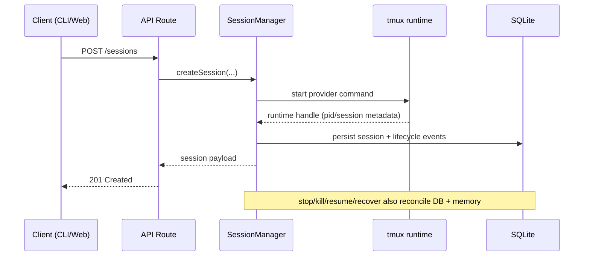
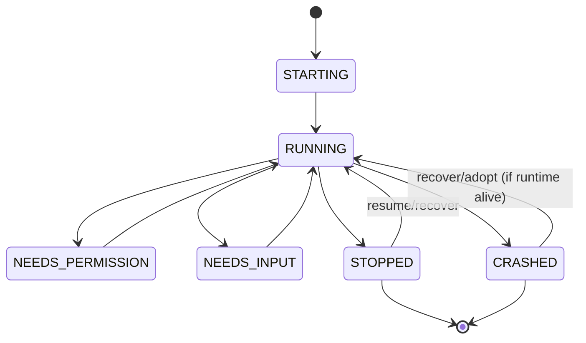

# CodePiper Architecture Overview

This is the high-signal architecture map for publish-ready development.

Use alongside:
- `AGENTS.md` for invariants and required verification gates.
- `CLAUDE.md` for subsystem-level deep detail.
- `docs/api/README.md` for endpoint contracts.

## 1) System Topology

```text
                      Local machine (single-user control plane)
--------------------------------------------------------------------------------

  codepiper CLI                         Web Dashboard (optional --web)
      |                                          |
      | Unix socket (trusted local)              | HTTPS (via reverse proxy)
      | No auth token required                   | or http://127.0.0.1:3000
      |                                          |
      v                                          v
  +----------------------------------------------------------------+
  |                          Daemon                                |
  |----------------------------------------------------------------|
  |                                                                |
  |  ┌─────────────────────────────────────────────────────────┐   |
  |  │ Request pipeline (HTTP path only)                       │   |
  |  │                                                         │   |
  |  │  WS /ws:  Origin gate ──> Auth ──> upgrade              │   |
  |  │  /api/*:  CSRF/Origin ──> Auth/MFA ──> Rate limit       │   |
  |  └─────────────────────────────────────────────────────────┘   |
  |                                                                |
  |  SessionManager (lifecycle owner)                              |
  |  Policy engine + workflow runner                               |
  |  Notification + push dispatcher                                |
  |                                                                |
  +------------------+---------------------------------------------+
                     |
      +--------------+--------------+
      |                             |
      v                             v
  tmux-backed providers          SQLite
  - Claude Code                   - sessions/events
  - Codex CLI                     - policies/audit
                                  - workflows
                                  - auth/settings
```

Primary packages:
- `packages/daemon` - lifecycle authority and runtime core.
- `packages/cli` - user and automation entrypoint.
- `packages/web` - dashboard UI.
- `packages/core` - shared core primitives.
- `packages/providers/claude-code` - provider overlay/settings.

## 2) Runtime Surfaces

| Surface | Transport | Auth | Security gates | Primary client |
|---------|-----------|------|----------------|----------------|
| Unix socket | `/tmp/codepiper.sock` | None (local-user trusted) | Owner-only permissions (`0600`) | CLI, scripts |
| HTTP | `127.0.0.1:<port>/api/*` | Cookie session + MFA | CSRF/origin check, rate limit | Web dashboard |
| WebSocket | `127.0.0.1:<port>/ws` | Cookie or `Authorization` | Origin gate (CSWSH prevention) | Web dashboard (PTY stream, events) |
| WebSocket (standalone) | `127.0.0.1:9999/ws` | Cookie or `Authorization` | Origin gate | Dedicated WS clients |

```text
Client request path
-------------------
  Unix socket              WS /ws                  API /api/*
  (CLI, scripts)           (browser PTY)            (browser HTTP)
       |                        |                        |
       |               ┌────────┴────────┐      ┌───────┴────────┐
       |               │ Origin gate     │      │ CSRF/Origin    │
       |               │ (ALLOWED_ORIGINS│      │ (POST/PUT/..   │
       |               │  + localhost)   │      │  + allowed     │
       |               └────────┬────────┘      │  hostnames)    │
       |                        |               └───────┬────────┘
       |               ┌────────┴────────┐              |
       |               │ Auth            │      ┌───────┴────────┐
       |               │ (cookie/header) │      │ Auth/MFA       │
       |               └────────┬────────┘      │ (session token)│
       |                        |               └───────┬────────┘
       |                        |                       |
       |                   WS upgrade           ┌───────┴────────┐
       |                                        │ Rate limit     │
       |                                        │ (per-IP)       │
       |                                        └───────┬────────┘
       |                                                |
       └────────────────────────────────────────────────┘
                                |
                                v
                         Route handler
```

Key distinction: Unix socket bypasses all HTTP security middleware (origin, auth, CSRF, rate limit) because it relies on OS-level access control (`chmod 0600`). The HTTP path enforces all layers.

## 3) Session Lifecycle Model

Source of truth:
- `packages/daemon/src/sessions/sessionManager.ts`
- `packages/daemon/src/main.ts`





## 4) Provider Capability Contract

Source of truth:
- `packages/daemon/src/providers/registry.ts`
- `GET /providers` in `packages/daemon/src/api/routes.ts`

Contract fields:
- `nativeHooks`
- `supportsDangerousMode`
- `supportsModelSwitch`
- `supportsTranscriptTailing`
- `supportsTmuxAdoption`
- `policyChannel` (`native-hooks|input-preflight|none`)
- `metricsChannel` (`transcript|pty|none`)
- `launchHints` (UI-facing command metadata: dangerous flags + resume templates)

Capability propagation path:

```text
daemon registry -> /providers response -> web capability helpers
                -> session/create UI gating -> tests enforce behavior
```

Rule:
- Feature exposure must be capability-driven, never provider-name-driven.

## 5) Security Boundaries

```text
Security layers (from outermost to innermost)
──────────────────────────────────────────────

Layer 1: Transport
  Unix socket ──> chmod 0600 (OS-level, owner-only)
  HTTP/WS     ──> CODEPIPER_ALLOWED_ORIGINS gate
                  - WS upgrade: rejectNonLocalOrigin()
                  - API mutate: rejectCrossSiteApiRequest()
                  Source: packages/daemon/src/api/server.ts

Layer 2: Authentication
  Password (Argon2) + TOTP MFA ──> session cookie
  Onboarding flow enforces MFA before issuing sessions
  CLI-only reset paths (reset-password, reset-mfa)
  Source: packages/daemon/src/auth/*

Layer 3: Request integrity
  CSRF ──> Origin/Referer match on POST/PUT/PATCH/DELETE
  API rate limit ──> per-IP sliding window
  Body size limit ──> per-route max (10MB images, 1MB default)
  Source: packages/daemon/src/api/server.ts, bodyLimit.ts

Layer 4: Authorization
  Hook secret ──> X-CodePiper-Secret header validation
  Policy engine ──> allow|deny|ask per tool/path pattern
  Input preflight ──> no-hook provider policy checks
  Source: packages/daemon/src/api/hooks.ts,
          packages/daemon/src/sessions/policyEngine.ts,
          packages/daemon/src/api/inputPolicy.ts

Layer 5: Data protection
  Env set encryption ──> AES-256-GCM at rest
  Billing isolation ──> ANTHROPIC_API_KEY scrub (subscription mode)
  CLAUDECODE scrub ──> always removed from session env
  Source: packages/daemon/src/crypto/encryption.ts
```

Security invariants:
- Never log secrets.
- Preserve subscription/API billing isolation semantics.
- Preserve `allow|deny|ask` compatibility behavior.

## 6) Data and Persistence

Source of truth:
- `packages/daemon/src/db/schema.sql`
- `packages/daemon/src/db/db.ts`

| Domain | Tables | Purpose |
|--------|--------|---------|
| Core | `sessions`, `events`, `transcript_offsets` | Session lifecycle, hook/transcript events, JSONL byte offsets |
| Policy | `policies`, `policy_decisions`, `policy_sets`, `policy_set_members`, `session_policy_sets` | Rules, M:N set membership, audit log |
| Workflows | `workflows`, `workflow_executions`, `workflow_steps` | DSL definitions and execution state |
| Analytics | `token_usage`, `model_switches`, `transcript_content` | Token tracking, model history, transcript storage |
| Settings | `workspaces`, `env_sets`, `daemon_settings` | Workspace config, encrypted env vars, global toggles |
| Auth | `auth_config`, `auth_sessions` | Password/MFA config, session tokens |
| Notifications | `session_notifications`, `push_subscriptions`, `session_notification_prefs` | Inbox, VAPID subscriptions, per-session prefs |

```text
Write paths into SQLite
-----------------------
CLI/API request ──> route handler ──> db.createSession() / db.insertEvent() / ...
                                          |
Hook event ──> hooks.ts ──> db.insertEvent() + policyEngine.evaluate()
                                          |
Transcript tailer ──> db.upsertTranscriptOffset() + db.insertTokenUsage()
                                          |
                                          v
                                     SQLite (WAL mode)
```

Design principle: **persist first, process later** — all state is written to SQLite before in-memory processing to ensure crash-safe recovery.

## 7) Extensibility Playbooks

### New provider (TUI)

1. Add provider and capabilities in daemon registry.
2. Expose/verify metadata through `/providers`.
3. Implement runtime command/lifecycle integration.
4. Add capability-gated route behavior (e.g. `409` for unsupported actions).
5. Add web presentation + conservative fallback metadata.
6. Gate UI surfaces by capabilities.
7. Add daemon/web/CLI tests.

See:
- `docs/features/provider-extensibility.md`
- `docs/features/provider-capability-matrix.md`

### New theme

1. Add preset in `packages/web/src/lib/themes/themePresets.ts`.
2. Verify CSS variables + xterm palette + Monaco mapping.
3. Verify contrast on dashboard + notifications + terminal surfaces.

See:
- `docs/features/theme-system.md`

## 8) Publish Readiness Checks

Before publish:
- Capability metadata is consistent between daemon and web.
- Unsupported provider surfaces are hidden/disabled.
- README/setup docs match runtime and package behavior.
- Architecture docs link to source-of-truth code paths.
