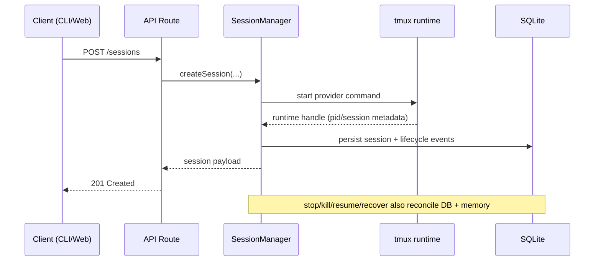
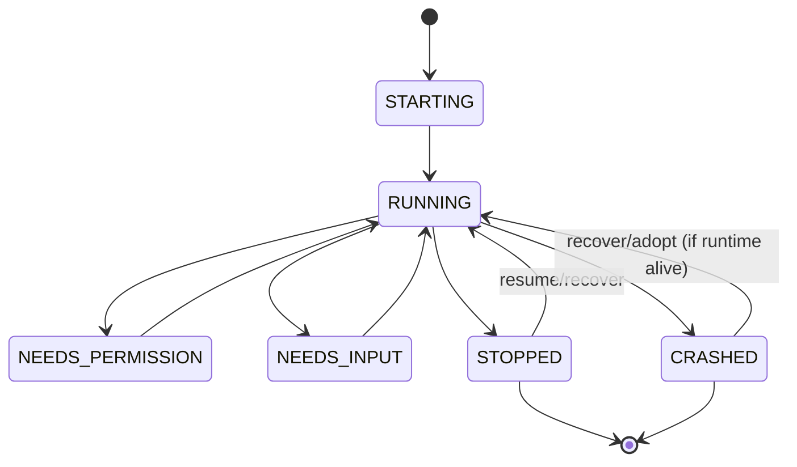

# CodePiper Architecture Overview

This is the high-signal architecture map for publish-ready development.

Use alongside:
- `AGENTS.md` for invariants and required verification gates.
- `CLAUDE.md` for subsystem-level deep detail.
- `docs/api/README.md` for endpoint contracts.

## 1) System Topology

```text
                      Local machine (single-user control plane)
--------------------------------------------------------------------------------
  codepiper CLI                    Web Dashboard (optional --web)
      |                                       |
      | Unix socket                           | HTTP /api + WebSocket /ws
      v                                       v
                      +-----------------------------------+
                      |            Daemon                 |
                      |-----------------------------------|
                      | API server + auth + CSRF/origin  |
                      | SessionManager (lifecycle owner) |
                      | Policy engine + workflow runner   |
                      | Notification + push dispatcher    |
                      +-------------------+---------------+
                                          |
                +-------------------------+-------------------------+
                |                                                   |
                v                                                   v
         tmux-backed provider runtimes                         SQLite
         - Claude Code                                          - sessions/events
         - Codex CLI                                            - policies/audit
                                                                - workflows
                                                                - auth/settings
```

Primary packages:
- `packages/daemon` - lifecycle authority and runtime core.
- `packages/cli` - user and automation entrypoint.
- `packages/web` - dashboard UI.
- `packages/core` - shared core primitives.
- `packages/providers/claude-code` - provider overlay/settings.

## 2) Runtime Surfaces

1. `Unix socket` (default: `/tmp/codepiper.sock`)
- Trusted local control path for CLI and scripts.

2. `HTTP + static web` (`--web`)
- API mounted at `/api/*`, auth/session middleware enforced.

3. `WebSocket` (`/ws`)
- Live PTY stream and session event fanout for dashboard UX.

## 3) Session Lifecycle Model

Source of truth:
- `packages/daemon/src/sessions/sessionManager.ts`
- `packages/daemon/src/main.ts`





## 4) Provider Capability Contract

Source of truth:
- `packages/daemon/src/providers/registry.ts`
- `GET /providers` in `packages/daemon/src/api/routes.ts`

Contract fields:
- `nativeHooks`
- `supportsDangerousMode`
- `supportsModelSwitch`
- `supportsTranscriptTailing`
- `supportsTmuxAdoption`
- `policyChannel` (`native-hooks|input-preflight|none`)
- `metricsChannel` (`transcript|pty|none`)
- `launchHints` (UI-facing command metadata: dangerous flags + resume templates)

Capability propagation path:

```text
daemon registry -> /providers response -> web capability helpers
                -> session/create UI gating -> tests enforce behavior
```

Rule:
- Feature exposure must be capability-driven, never provider-name-driven.

## 5) Security Boundaries

Critical controls and authorities:
- Hook auth secret validation (`X-CodePiper-Secret`) in `packages/daemon/src/api/hooks.ts`.
- Auth/MFA/session enforcement in `packages/daemon/src/auth/*`.
- HTTP CSRF/origin protections in `packages/daemon/src/api/server.ts`.
- Encrypted env storage in `packages/daemon/src/crypto/encryption.ts`.
- No-hook provider preflight policy checks in `packages/daemon/src/api/inputPolicy.ts`.

Security invariants:
- Never log secrets.
- Preserve subscription/API billing isolation semantics.
- Preserve `allow|deny|ask` compatibility behavior.

## 6) Data and Persistence

Source of truth:
- `packages/daemon/src/db/schema.sql`
- `packages/daemon/src/db/db.ts`

Core persisted domains:
- session lifecycle, events, transcript offsets.
- policies/policy sets/audit decisions.
- workflows/executions.
- auth configuration/sessions.
- daemon settings/workspaces/env sets.
- notifications and push subscriptions.

## 7) Extensibility Playbooks

### New provider (TUI)

1. Add provider and capabilities in daemon registry.
2. Expose/verify metadata through `/providers`.
3. Implement runtime command/lifecycle integration.
4. Add capability-gated route behavior (e.g. `409` for unsupported actions).
5. Add web presentation + conservative fallback metadata.
6. Gate UI surfaces by capabilities.
7. Add daemon/web/CLI tests.

See:
- `docs/features/provider-extensibility.md`
- `docs/features/provider-capability-matrix.md`

### New theme

1. Add preset in `packages/web/src/lib/themes/themePresets.ts`.
2. Verify CSS variables + xterm palette + Monaco mapping.
3. Verify contrast on dashboard + notifications + terminal surfaces.

See:
- `docs/features/theme-system.md`

## 8) Publish Readiness Checks

Before publish:
- Capability metadata is consistent between daemon and web.
- Unsupported provider surfaces are hidden/disabled.
- README/setup docs match runtime and package behavior.
- Architecture docs link to source-of-truth code paths.
